### HW02_Git-advanced.md

> Данное домашнее задание является продолжением домашнего задания, которое вы выполняли на предыдущем семинаре в репозитории с собственным проектом.
>1. Просмотрите историю коммитов в своём проекте и выберите три случайных коммита. Просмотрите изменения, которые были в них сделаны.

```bash
# > Просмотрите изменения, которые были в них сделаны.
# 
git log --oneline
```
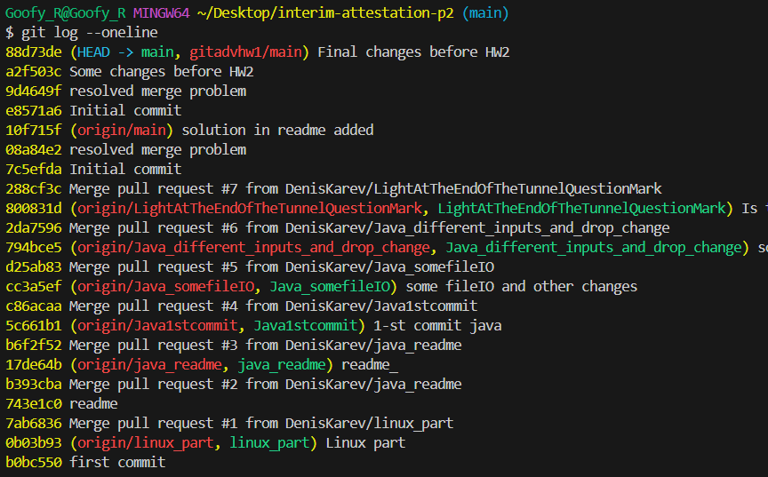
```bash
git diff 8008 --stat    # 800831d but 4 digits is ok )
git diff 17de64b --stat
git diff 5c661b1 --stat
```
.png)
.png)
.png)

>2. Верните эти изменения командой git revert последовательно, чтобы в итоге получилось тоже три коммита.

```bash
# and reverting random 3 commits on new branch? probably
# git checkout -b three_reverts # i think -- not today )
git revert 8008
git revert 17de64b
git revert 794bce5
```
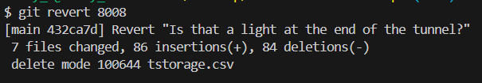
```bash
# README.md requred some editing to solve conflict
```
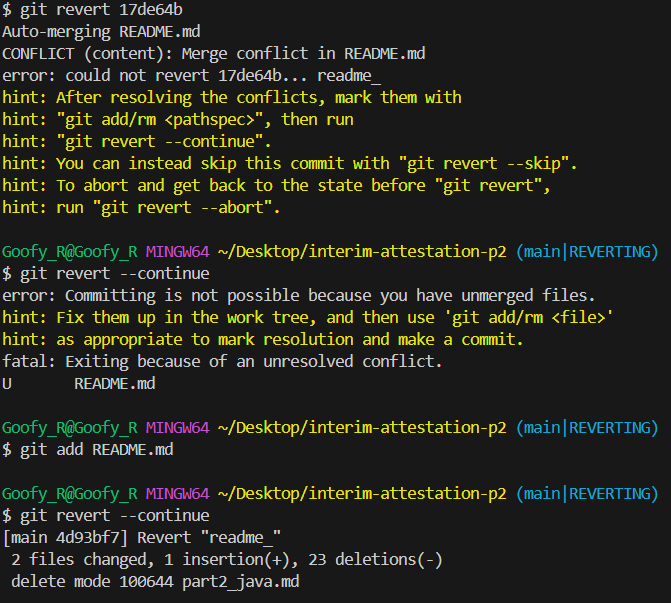
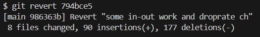
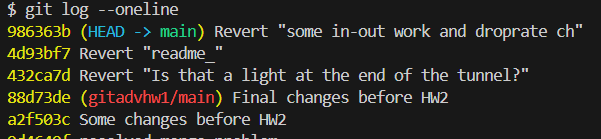
>3. Попробуйте отменить эти три коммита:
>* последний — командами git reset --soft и git restore;
```bash
git reset --soft 4d93bf7
```
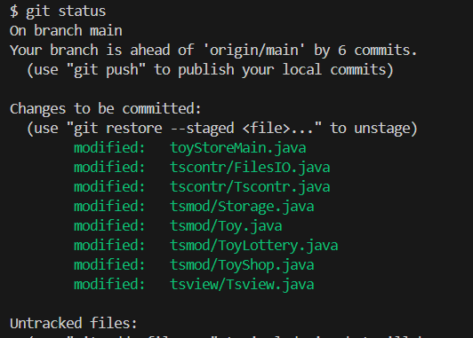
```bash
# and then git restore -S <file name to Unstage> because they all staged? we revert the commit only
git restore -S toyStoreMain.java
git restore -S tscontr/FilesIO.java
git restore -S tscontr/Tscontr.java
git restore -S tsmod/Storage.java
git restore -S tsmod/Toy.java
git restore -S tsmod/ToyLottery.java
git restore -S tsmod/ToyShop.java
git restore -S tsview/Tsview.java
```
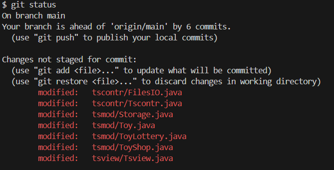
```bash
# and after that we need to discard changes with git restore <file name to Discard Changes>
git restore toyStoreMain.java
git restore tscontr/FilesIO.java
git restore tscontr/Tscontr.java
git restore tsmod/Storage.java
git restore tsmod/Toy.java
git restore tsmod/ToyLottery.java
git restore tsmod/ToyShop.java
git restore tsview/Tsview.java
# all of this was almost painfull %)) i wonder that next part will be only half than this one )
```
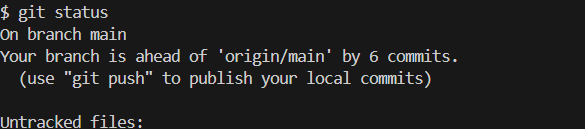
>* предпоследний — командой git reset --mixed и git restore;
```bash
git reset 432ca7d # --mixed is default option so ))) we are lazy today and don't type it
```
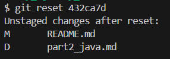
```bash
git restore README.md part2_java.md # to finally discard changes in files
# and git status is clear, we restore changes ))
```
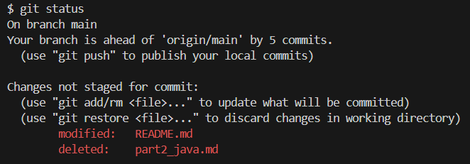
>* первый — командой git reset --hard.
```bash
# the option with the less questions it hardly restores commit w/o questions
git reset --hard 88d73de
git log --oneline
```
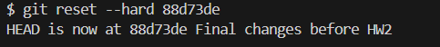
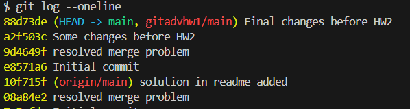
```bash
final status
```